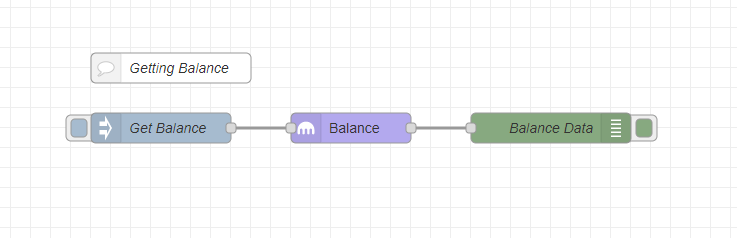

# Kraken Node

<a href="https://nodered.org" target="_blank">Node-RED</a> node to interact with <a href="https://www.kraken.com/" target="_blank">Kraken</a>.

## Install

Run the following command in the root directory of your Node-RED instance:

```
npm install --save node-red-contrib-kraken
```

## Usage

This is a Kraken API client node. It makes API requests by sending `msg.payload` data to the specified API endpoint and outputs the response data as `msg.payload`.

### Configuration

You first need to create a new API Key:

1. Go to <a href="https://www.kraken.com/u/settings/api" target="_blank">API Key Management</a> on your Kraken account
2. Click the `Generate New Key` button
3. Enter a description and set permissions based on what API methods you'd execute
4. Click the `Generate Key` button

Now you need to configure your Kraken client:

1. Open your Node-RED instance
2. Drag & drop the `kraken api` node from the palette to the workspace and double-click on it, to open the node editor
3. In the `Client` dropdown menu pick the `Add New kraken-api-config` option and press the pencil button at the right to add a new API configuration
4. Copy-paste `API Key` and `Private Key` from the key page on Kraken to the node editor
5. Push `Update`

### Making API requests

To make requests using the `kraken-api` node, you need to pick the api method the node will call. This can be either specified in the node settings, or provided in `msg.method` (if the method set to "via msg.method"). And `msg.payload` is the api input data.

After executing a request the node returns a message with the response data set to `msg.payload`.

## Examples

### Getting Account Balance

This example enables to get your account balance by clicking the inject button. The "Balance Data" node outputs your balance data to Debug window.



Flow json for Node-RED: [kraken-getting-balance.json](examples/kraken-getting-balance.json)

### Adding Orders

This example implements a simple way to add pre-configured (in the "🔨 Order params" node) orders by clicking the inject button. The "Order Confirmation" node outputs the order description info to Debug window.


Flow json for Node-RED: [kraken-adding-orders.json](examples/kraken-adding-orders.json)

### More Examples

- [Exchanging Part Of Amount From Paid Invoices](https://redbtc.org/flows/integrations/kraken-exchange)

## API Reference

Kraken API Reference: https://www.kraken.com/features/api

## Donate 💝

If you want to support this free open-source project, you can [donate by clicking this link](https://donate.alexkaul.com/kraken-node)

## Developing Nodes

Build & Test in Watch mode:

```
yarn dev
```

## Testing Node Set in Node-RED

[Read Node-RED docs](https://nodered.org/docs/creating-nodes/first-node#testing-your-node-in-node-red) on how to install the node set into your Node-RED runtime.

## License

MIT © Alex Kaul
